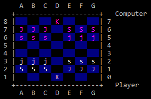

# Sockfish
AI for game Hi-Ya! (CSC 180 Fall 2017)
based on Stockfish [1]

Winner of CSC 180 Fall 2017 AI Tournament, 19-1 [2]

**Features - **
* Minimax (implemented with Negamax [3])
* Alpha-Beta Pruning
* Iterative Deepening
* Top-Level PV Move Ordering
* Killer Move
* Countermove
* History Heuristic
* Transposition Table (Zobrist Hash for key)
* Multithreading (Lazy SMP [4])
* Bitboards + Magic Bitboards
* Evaluation Heurisitics: Piece Value, Piece Position, Piece Moves

**References - **
[1]: https://github.com/official-stockfish/Stockfish
[2]: http://athena.ecs.csus.edu/~gordonvs/180/Tournaments/17Ftres.html
[3]: https://en.wikipedia.org/wiki/Negamax
[4]: https://chessprogramming.wikispaces.com/Lazy+SMP